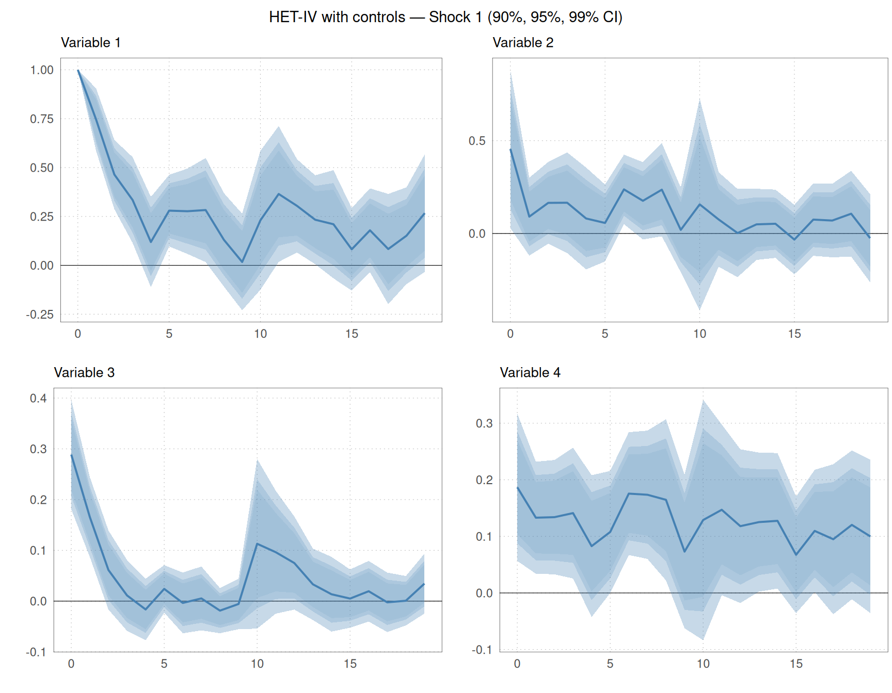
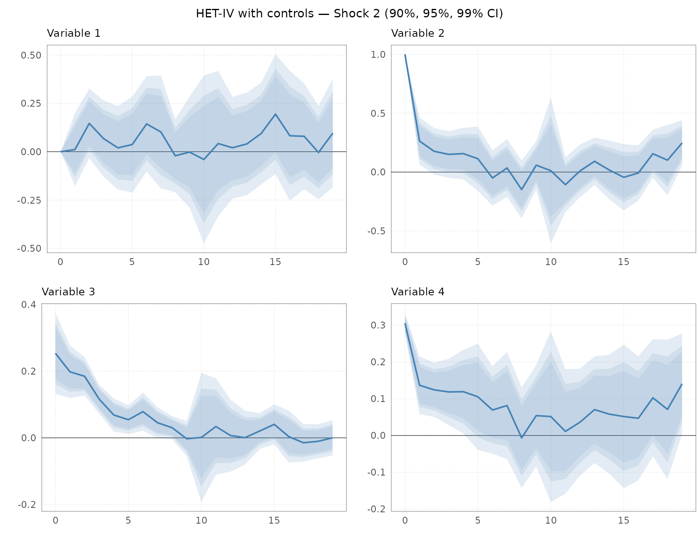
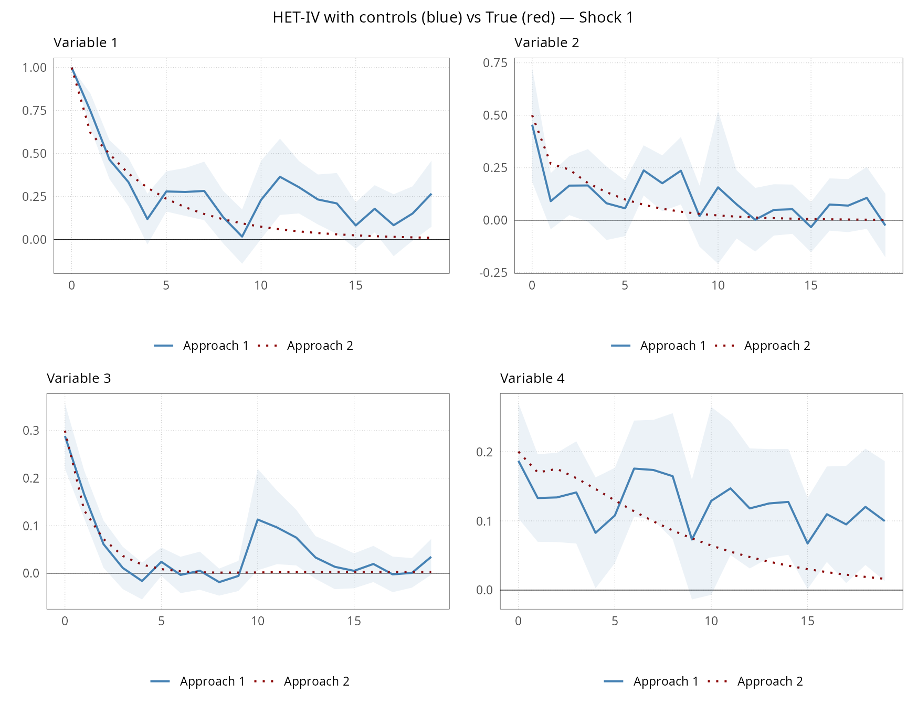
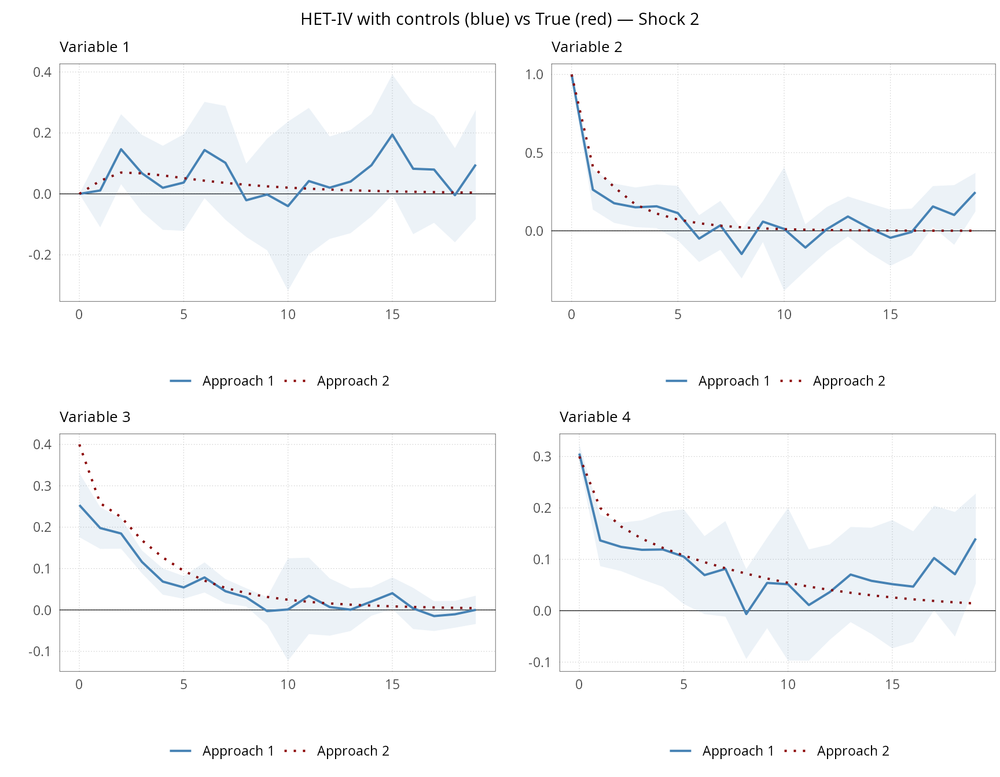
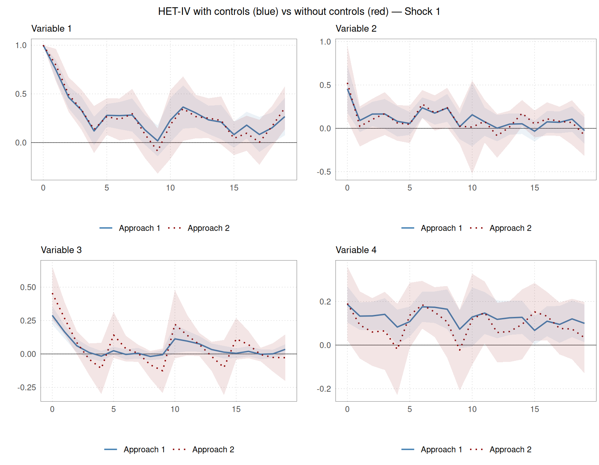
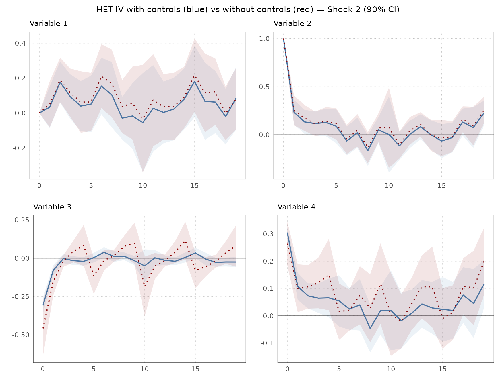
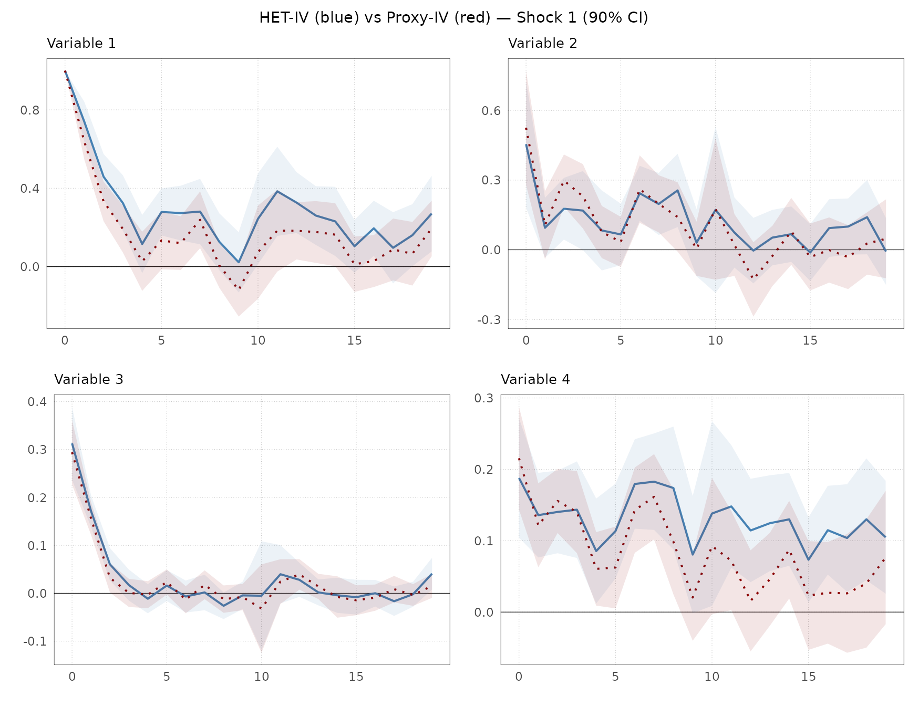
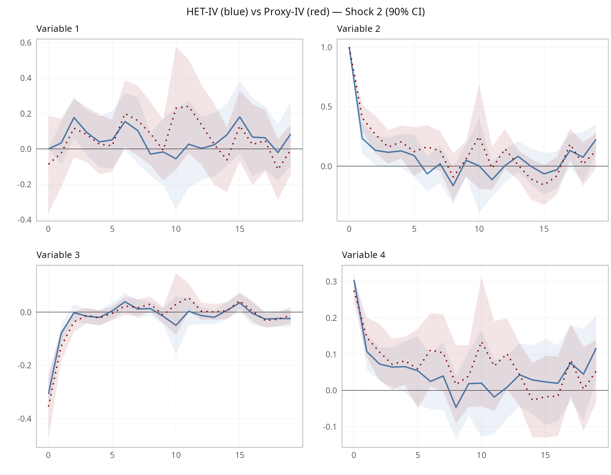

# Estimating Dynamic Causal Effects with hetiv

## Introduction

**hetiv** provides tools for measuring and identifying multi-dimensional
structural shocks in dynamic models models using two complementary IV
approaches:

- **Heteroskedasticity-IV** (Rigobon 2003, Rigobon and Sack 2004, Lewis
  2022, Burri and Kaufmann, 2026a): exploits the higher variance of
  outcome variables on policy event days relative to control days to
  identify structural shocks without requiring external instruments.
- **Proxy-IV** (Mertens and Ravn 2013, Stock and Watson 2018): uses an
  external instrument (proxy) that is correlated with the shock of
  interest but uncorrelated with other shocks.

Both approaches are implemented as local projection IV estimators
following Jordà (2005), which directly produce impulse response
functions (IRFs) across multiple horizons. Inference is based on HC
robust standard errors (Montiel Olea et al., 2025).

The package allows for multiple shocks and endogenous variables.
Weak-instrument HAR inference is implemented via the generalised minimum
eigenvalue test of Lewis and Mertens (2025), which nests the classical
Stock-Yogo (2005) test for the univariate homoskedastic case.
`gweakivtest`is a direct port of the Matlab files by Lewis and Mertens
(2025) available on **<https://karelmertens.com/research/>**.

In addition, the package provides the function
[`kfpredict()`](https://dankaufmann.github.io/hetiv/reference/kfpredict.md)
for predicting the underlying unobserved shocks based on the
Kalman-filter, as suggested by Burri and Kaufmann (2026b).

This vignette demonstrates the functionality using a simulated
four-variable VAR with two structural shocks.

## Simulated data

We simulate data from a VAR(2) with $`N = 4`$ variables, $`E = 2`$ event
(policy) shocks, $`R = 2`$ regular shocks, and $`P = 2`$ lags over
$`T = 500`$ observations. The model reads:

``` math
y_t = \Psi \varepsilon_t + \Gamma v_t + \Phi(L) y_{t-1} + \beta X_t \ \ \text{for } t\in \mathcal{P}
```

``` math
y_t =  \Gamma v_t + \Phi(L) y_{t-1} + \beta X_t \ \ \text{for } t\in \mathcal{C}
```

where $`\mathcal{P}, \mathcal{C}`$ denote policy event and other days,
respectively, $`\Psi`$ is the impact matrix of $`E`$ policy event shocks
and $`\Gamma`$ the impact matrix of $`R`$ other shocks. $`\Phi(L)`$ is a
conformable lag polynomial, and $`X_t`$ an matrix of deterministic
terms.

Regular shocks occur on all days. A policy event occurs every 10th
period (approximately 10% of observations). The latter introduces
heteroskedasticity in the variance-covariance matrix of the reduced-form
residuals
[`hetiv()`](https://dankaufmann.github.io/hetiv/reference/hetiv.md)
exploits to identify the impulse response functions. Shocks are drawn
from a standard normal distribution. The impact matrix is
lower-triangular, corresponding to the identifying assumption by Burri
and Kaufmann (2026a) that the first shock has a contemporaneous effect
on all variables, while the second shock has no contemporaneous effect
on the first variable. Deterministic weekday patterns are added to
variables 3 and 4 to illustrate the role of controls. The event
indicator `Ind` equals 1 on policy event days and 0 on control days.

``` r

library(hetiv)

# Dimensions
N  <- 4   # variables
E  <- 2   # event shocks
R  <- 2   # regular shocks
P  <- 2   # VAR lag order
H  <- 20  # IRF horizons
Nevn <- 10 # Frequency of event shocks

# Impact matrix for event shocks (N x E); lower triangular for recursive ID
PsiE      <- matrix(0, N, E)
PsiE[, 1] <- c(1.0,  0.5,  0.3,  0.2)
PsiE[, 2] <- c(0.0,  1.0,  -0.4,  0.3)

SigE <- 4  # event shock variance (scalar, applies to all E shocks)

# Impact matrix for regular shocks (N x R)
PsiR      <- matrix(0, N, R)
PsiR[, 1] <- c( 1.0, -0.3,  0.2,  0.1)
PsiR[, 2] <- c( 0.2,  1.0, -0.1,  0.4)

# VAR coefficient matrices at lags 1 and 2
Phi       <- array(0, dim = c(N, N, P))
Phi[,, 1] <- matrix(c( 0.60,  0.05, -0.04,  0.03,
                        0.06,  0.40,  0.05, -0.03,
                       -0.05,  0.04,  0.50,  0.06,
                        0.03, -0.03,  0.05,  0.70), N, N, byrow = TRUE)
Phi[,, 2] <- matrix(c( 0.10,  0.03, -0.02,  0.02,
                        0.04,  0.10,  0.03, -0.02,
                       -0.03,  0.02,  0.10,  0.03,
                        0.02, -0.02,  0.03,  0.10), N, N, byrow = TRUE)

# Simulate — seed is set internally by simulatedata()
Nobs <- 500
Nbin <- 100
sim  <- simulatedata(
  Phi = Phi, SigE = SigE, PsiE = PsiE, PsiR = PsiR,
  Nobs = Nobs, Nbin = Nbin, N = N, R = R, E = E,
  Nevn = Nevn, P = P, eDist = 0, seed = 42
)

# Extract simulated data and event indicator
y_data <- sim$y
Ind    <- as.integer(sim$IndE[, 1])

# Add deterministic weekday variation into variables 3 and 4
y_data[, 3] <- y_data[, 3] + 0.5 * seq_len(Nobs) %% 5
y_data[, 4] <- y_data[, 4] + 0.3 * seq_len(Nobs) %% 5
```

To illustrate the proxy-IV approach, we construct a noisy external
instrument for the two event shocks by adding Gaussian noise to the true
shocks. The proxy is observed only on policy event days and set to `NA`
on control days. This mirrors the typical situation in high-frequency
identification of monetary policy shocks, where the high-frequency
surprises are only observed on policy announcement days.

``` r

# RNG state after simulatedata(seed = 42) is deterministic, so no extra seed needed
e_proxy       <- sim$eE
e_proxy[, 1]  <- e_proxy[, 1] + rnorm(Nobs, sd = 1)
e_proxy[, 2]  <- e_proxy[, 2] + rnorm(Nobs, sd = 1)
e_proxy[Ind == 0, ] <- NA
```

## Estimation

### Heteroskedasticity-IV without controls

First, we estimate a misspecified model, failing to control for lagged
dependent variables and weekday-variation. Note that we impose a
normalization on the impact on the endogenous variable for every shock.
The value of the normalization can be chosen by `norm`. Here, we choose
the normalization that corresponds to the true impact matrix.

``` r

res_het <- hetiv(
  y       = y_data,
  O       = y_data,
  Ind     = Ind,
  P       = 0,
  H       = H,
  E       = E,
  norm    = 1,
  details = TRUE
)
```

### Heteroskedasticity-IV with controls

Second, we estimate the correctly specified model, with $`P = 2`$ lags
and the weekday dummies. Note that the weekday dummies absorb the
deterministic pattern that we added to the data. The regressions
generally include a constant term. Therefore, we only add four weekday
dummies.

``` r


# Weekday dummies: four indicator variables (one left out as reference)
X_data <- matrix(0, nrow = Nobs, ncol = 4)
for (i in 1:4) X_data[, i] <- as.integer((seq_len(Nobs)) %% 5 == (i - 1))

res_het_X <- hetiv(
  y       = y_data,
  O       = y_data,
  X       = X_data,
  Ind     = Ind,
  P       = P,
  H       = H,
  E       = E,
  norm    = 1,
  details = TRUE
)
```

### Proxy-IV

Third, we use the external instrument to estimate the model via
proxy-IV. The same lags are included as in the second model. However,
the weekday dummies are dropped due to collinearity, as only the event
days are used to identify the responses. Note that the proxy-IV function
still requires `Ind` as an input, because, in case the instrument is
missing, but `Ind = 1`, we can later on predict the unobserved shock
using the Kalman filter with
[`kfpredict()`](https://dankaufmann.github.io/hetiv/reference/kfpredict.md)
(see Burri and Kaufmann, 2026a).

``` r

res_proxy <- proxyiv(
  y         = y_data,
  O         = y_data,
  Z         = e_proxy,
  Ind       = Ind,
  P         = P,
  H         = H,
  E         = E,
  norm      = 1,
  recursive = FALSE,
  details   = TRUE
)
```

### Proxy-IV with recursive zero restriction

If the proxies are valid, we do not need additional restrictions to
identify the impulse responses. However, the function allows us to
additionally impose zero restrictions mirroring the assumptions used by
[`hetiv()`](https://dankaufmann.github.io/hetiv/reference/hetiv.md).
This is useful in a situation where there is some doubt about the
validity of the external instruments, and the researcher is convinced
that a zero restriction is valid.

``` r

res_proxy_rec <- proxyiv(
  y         = y_data,
  O         = y_data,
  Z         = e_proxy,
  Ind       = Ind,
  P         = P,
  H         = H,
  E         = E,
  norm      = 1,
  recursive = TRUE,
  details   = TRUE
)
```

## Impact matrices

The estimated impact matrix $`\Psi`$ gives the contemporaneous responses
of all $`N`$ variables to each structural shock. We can compare the
estimates across the four specifications against the true $`\Psi`$. At
first sight, the differences are small. As we will see below, there are
still some differences in terms of the accuracy of the estimates, the
predicted shocks, and the strength of the instruments.

``` r


tab_1 <- round(data.frame(
            True = PsiE[, 1], 
            HET_IV = res_het$Psi[, 1], 
            HET_IV_X = res_het_X$Psi[, 1],
            Proxy_IV = res_proxy$Psi[, 1], 
            Proxy_IV_rec = res_proxy_rec$Psi[, 1]), 2)

knitr::kable(
  tab_1,
  col.names = c("True", "HET-IV without controls", "HET-IV with controls", "Proxy-IV with controls", "Proxy-IV with recursive restriction"),
  caption   = "Impact matrix estimates ($\\Psi$) for shock 1 across different specifications"
)
```

| True | HET-IV without controls | HET-IV with controls | Proxy-IV with controls | Proxy-IV with recursive restriction |
|---:|---:|---:|---:|---:|
| 1.0 | 1.00 | 1.00 | 1.00 | 1.00 |
| 0.5 | 0.53 | 0.45 | 0.53 | 0.53 |
| 0.3 | 0.52 | 0.31 | 0.29 | 0.29 |
| 0.2 | 0.20 | 0.19 | 0.22 | 0.22 |

Impact matrix estimates ($`\Psi`$) for shock 1 across different
specifications {.table}

``` r


tab_2 <- round(data.frame(
            True = PsiE[, 2], 
            HET_IV = res_het$Psi[, 2], 
            HET_IV_X = res_het_X$Psi[, 2],
            Proxy_IV = res_proxy$Psi[, 2], 
            Proxy_IV_rec = res_proxy_rec$Psi[, 2]), 2)

knitr::kable(
  tab_2,
  col.names = c("True", "HET-IV without controls", "HET-IV with controls", "Proxy-IV with controls", "Proxy-IV with recursive restriction"),
  caption   = "Impact matrix estimates ($\\Psi$) for shock 2 across different specifications"
)
```

| True | HET-IV without controls | HET-IV with controls | Proxy-IV with controls | Proxy-IV with recursive restriction |
|---:|---:|---:|---:|---:|
| 0.0 | 0.00 | 0.00 | -0.09 | 0.00 |
| 1.0 | 1.00 | 1.00 | 1.00 | 1.00 |
| -0.4 | -0.46 | -0.31 | -0.35 | -0.31 |
| 0.3 | 0.26 | 0.31 | 0.28 | 0.28 |

Impact matrix estimates ($`\Psi`$) for shock 2 across different
specifications {.table}

## Impulse response functions

### Impulse responses with confidence intervals

We can assess the accuracy of the estimates, and the dynamic causal
effects, using
[`plotirf()`](https://dankaufmann.github.io/hetiv/reference/plotirf.md).
The function plots IRFs with shaded confidence bands for one estimation
approach. The confidence levels can be chosen freely. Here, we show the
90%, 95%, and 99% confidence intervals for the HET-IV estimates with
controls.

``` r

var_labels <- paste0("Variable ", 1:N)

plots_het_X <- plotirf(
  IRFest = res_het_X$irf,
  IRFse  = res_het_X$se,
  HTick  = 5,
  Labels = var_labels,
  ci     = c(0.90, 0.95, 0.99)
)

for (j in seq_len(E)) {
  idx   <- ((j - 1) * N + 1):(j * N)
  panel <- cowplot::plot_grid(plotlist = plots_het_X[idx], ncol = 2)
  title <- cowplot::ggdraw() +
    cowplot::draw_label(paste0("HET-IV with controls — Shock ", j, " (90%, 95%, 99% CI)"), size = 11)
  print(cowplot::plot_grid(title, panel, ncol = 1, rel_heights = c(0.05, 1)))
}
```



### HET-IV estimates versus true IRF

We can compare the estimates to the true impulse responses.
[`plot2irf()`](https://dankaufmann.github.io/hetiv/reference/plot2irf.md)
overlays two sets of IRFs. We compare the HET-IV estimate (blue) against
the theoretical IRF computed from the known VAR parameters (red). The
function
[`computeirf()`](https://dankaufmann.github.io/hetiv/reference/computeirf.md)
computes the theoretical IRF. The standard errors for the true IRF are
set to zero, so that no confidence bands are plotted for the true IRF.

``` r

irf_true    <- computeirf(PsiE, Phi, H, cum = FALSE)
irf_true_se <- array(0, dim = dim(irf_true), dimnames = dimnames(irf_true))

plots_vs_true <- plot2irf(
  IRF1   = res_het_X$irf,
  IRF1se = res_het_X$se,
  IRF2   = irf_true,
  IRF2se = irf_true_se,
  HTick  = 5,
  Labels = var_labels,
  ci     = 0.90
)

for (j in seq_len(E)) {
  idx   <- ((j - 1) * N + 1):(j * N)
  panel <- cowplot::plot_grid(plotlist = plots_vs_true[idx], ncol = 2)
  title <- cowplot::ggdraw() +
    cowplot::draw_label(
      paste0("HET-IV with controls (blue) vs True (red) — Shock ", j, " (90% CI)"), size = 11)
  print(cowplot::plot_grid(title, panel, ncol = 1, rel_heights = c(0.05, 1)))
}
```



### HET-IV estimates versus misspecified model

We can also compare the accuracy of the estimates using the correct and
misspecified models.

``` r


plots_vs_true <- plot2irf(
  IRF1   = res_het_X$irf,
  IRF1se = res_het_X$se,
  IRF2   = res_het$irf,
  IRF2se = res_het$se,
  HTick  = 5,
  Labels = var_labels,
  ci     = 0.90
)

for (j in seq_len(E)) {
  idx   <- ((j - 1) * N + 1):(j * N)
  panel <- cowplot::plot_grid(plotlist = plots_vs_true[idx], ncol = 2)
  title <- cowplot::ggdraw() +
    cowplot::draw_label(
      paste0("HET-IV with controls (blue) vs without controls (red) — Shock ", j, " (90% CI)"), size = 11)
  print(cowplot::plot_grid(title, panel, ncol = 1, rel_heights = c(0.05, 1)))
}
```



We see that the confidence intervals are wider using the misspecified
model (red). This is especially true for the third and fourth variables
that are affected by the deterministic weekday pattern. The misspecified
model does not account for this pattern, which leads to more uncertainty
and biased estimates. But also, the intervals are somewhat wider or
variables 1 and 2 because we fail to control for lagged dependent
variables.

### HET-IV versus Proxy-IV

Next, we compare the HET-IV estimates to the Proxy-IV estimates. We
obtain relatively similar results with both approaches.However, the
point estimates are quite similar across the two approaches.

``` r

plots_vs_proxy <- plot2irf(
  IRF1   = res_het_X$irf,
  IRF1se = res_het_X$se,
  IRF2   = res_proxy$irf,
  IRF2se = res_proxy$se,
  HTick  = 5,
  Labels = var_labels,
  ci     = 0.90
)

for (j in seq_len(E)) {
  idx   <- ((j - 1) * N + 1):(j * N)
  panel <- cowplot::plot_grid(plotlist = plots_vs_proxy[idx], ncol = 2)
  title <- cowplot::ggdraw() +
    cowplot::draw_label(
      paste0("HET-IV (blue) vs Proxy-IV (red) — Shock ", j, " (90% CI)"), size = 11)
  print(cowplot::plot_grid(title, panel, ncol = 1, rel_heights = c(0.05, 1)))
}
```



## Shock extraction

[`kfpredict()`](https://dankaufmann.github.io/hetiv/reference/kfpredict.md)
recovers structural shocks from reduced-form residuals via a Kalman
filter prediction. It requires the estimated impact matrix `Psi`, the
residual covariance matrices on event and control days (`Sig`, `SigR`),
and the residuals `et`.

``` r

shocks_het   <- kfpredict(Sig = res_het$Sig,   SigR = res_het$SigR,
                           Psi = res_het$Psi,   et   = res_het$et)

shocks_het_X <- kfpredict(Sig = res_het_X$Sig, SigR = res_het_X$SigR,
                           Psi = res_het_X$Psi, et   = res_het_X$et)

shocks_proxy <- kfpredict(Sig = res_proxy$Sig, SigR = res_proxy$SigR,
                           Psi = res_proxy$Psi, et   = res_proxy$et)

shocks_proxy_rec <- kfpredict(Sig = res_proxy_rec$Sig, SigR = res_proxy_rec$SigR,
                           Psi = res_proxy_rec$Psi, et   = res_proxy_rec$et)
```

We assess the accuracy of the prediction comparing them to the true
event shocks from the underlying model.

``` r

true_shocks <- sim$eE

cor_df1<- data.frame(
    True       = true_shocks[, 1],
    Proxy      = e_proxy[, 1],
    HET_IV     = shocks_het[, 1],
    HET_IV_X   = shocks_het_X[, 1],
    Proxy_IV_X = shocks_proxy[, 1],
    Proxy_IV_Rec = shocks_proxy_rec[, 1]
)

cor_df2<- data.frame(
    True       = true_shocks[, 2],
    Proxy      = e_proxy[, 2],
    HET_IV     = shocks_het[, 2],
    HET_IV_X   = shocks_het_X[, 2],
    Proxy_IV_X = shocks_proxy[, 2],
    Proxy_IV_Rec = shocks_proxy_rec[, 2]
)

tab_all <- data.frame(
      rbind(round(cor(cor_df1, use = "complete.obs"), 2)[1, ],
            round(cor(cor_df2, use = "complete.obs"), 2)[1, ])
            )
rownames(tab_all) <- c("Shock 1", "Shock 2")

knitr::kable(tab_all,
    col.names = c("True", "Proxy", "HET-IV without controls", "HET-IV with controls", "Proxy-IV with controls", "Proxy-IV with recursive restriction"),
    row.names = TRUE,
    caption   = "Correlation of predicted shocks with true shocks"
    )
```

|  | True | Proxy | HET-IV without controls | HET-IV with controls | Proxy-IV with controls | Proxy-IV with recursive restriction |
|:---|---:|---:|---:|---:|---:|---:|
| Shock 1 | 1 | 0.91 | 0.70 | 1.00 | 0.98 | 0.98 |
| Shock 2 | 1 | 0.80 | 0.85 | 0.94 | 0.89 | 0.88 |

Correlation of predicted shocks with true shocks {.table}

The correlation between the true shocks and the proxy is slightly lower
than one due to an attenuation bias (see Burri and Kaufmann, 2026a),
which depends on the variance of the noise term affecting the proxy. The
correlation of the prediction is also relatively low if we use a
misspecified model. However, if we use the correct model, the
correlation is is close to unity for Shock 1 and 0.94 for Shock 2.
Proxy-IV with controls yields a high correlation as well, at least for
Shock 1. Note that the specific values depend on the exact nature of the
simulated data

## Weak instrument test

[`gweakivtest()`](https://dankaufmann.github.io/hetiv/reference/gweakivtest.md)
implements the generalised minimum eigenvalue test of Lewis and Mertens
(2025), which is robust to heteroskedasticity and autocorrelation and
applicable to multiple endogenous regressors and multiple instruments.
Note that classical Stock-Yogo (2005) test is applicable only for the
homoskedastic case.

Both [`hetiv()`](https://dankaufmann.github.io/hetiv/reference/hetiv.md)
and
[`proxyiv()`](https://dankaufmann.github.io/hetiv/reference/proxyiv.md)
return a `WeakData` object when `details = TRUE`. This data frame
contains the data expected by
[`gweakivtest()`](https://dankaufmann.github.io/hetiv/reference/gweakivtest.md).
The code below extracts the relevant columns from the `WeakData` data
frame and runs the weak instrument test for each of the four
specifications. For illustration, we use the heteroskedasticity-robust
version (`EHW`). For the HAR (Newey West) version, use the option `NW`.
By default, the function uses a bias tolerance of 10% at a significance
level of 5%.

``` r

# Helper: extract y, Y, X, Z from WeakData and run gweakivtest
run_weaktest <- function(weakdata, E) {
  # y: outcome variable E+1 (not used as endogenous regressor)
  y <- weakdata[, paste0("y", E + 1)]
  # Y: first E outcome variables (endogenous regressors)
  Y <- weakdata[, paste0("y", 1:E)]
  # Z: the E instruments
  Z <- weakdata[, paste0("Z", 1:E),]
  # X: lagged ("o*") and deterministic ("x*") control columns. In any case, add a constant term as well.
  # Note that gweakivtest() adds a constant term if missing
  ctrl  <- startsWith(colnames(weakdata), "o") | startsWith(colnames(weakdata), "x") | startsWith(colnames(weakdata), "i")
  X     <- if (any(ctrl)) cbind(weakdata[, ctrl], matrix(1, nrow(weakdata), 1)) else matrix(numeric(0), nrow(weakdata), 0)

  gweakivtest(y, Y, X, Z, cov_type = "EHW")
}

specs <- list(
  "HET-IV, no controls"                            = res_het$WeakData,
  "HET-IV, with controls"                          = res_het_X$WeakData,
  "Proxy-IV, with controls"                        = res_proxy$WeakData,
  "Proxy-IV, with controls + recursive restriction" = res_proxy_rec$WeakData
)

wt_results <- lapply(specs, run_weaktest, E = E)
```

``` r

tab <- do.call(rbind, lapply(names(wt_results), function(nm) {
  r <- wt_results[[nm]]
  data.frame(
    Specification = nm,
    Statistic     = round(r$gmin_generalized, 2),
    LM_CV         = round(r$gmin_generalized_critical_value, 2),
    Strong        = ifelse(r$gmin_generalized > r$gmin_generalized_critical_value,
                           "Yes", "No"),
    stringsAsFactors = FALSE
  )
}))

knitr::kable(
  tab,
  col.names = c("Specification", "Statistic", "LM critical value",
                "Strong instruments?"),
  caption   = "Weak instrument test results (Lewis-Mertens generalised minimum eigenvalue test)"
)
```

| Specification | Statistic | LM critical value | Strong instruments? |
|:---|---:|---:|:---|
| HET-IV, no controls | 15.55 | 38.28 | No |
| HET-IV, with controls | 88.68 | 47.23 | Yes |
| Proxy-IV, with controls | 23.03 | 23.27 | No |
| Proxy-IV, with controls + recursive restriction | 23.03 | 23.27 | No |

Weak instrument test results (Lewis-Mertens generalised minimum
eigenvalue test) {.table}

The specification without controls is affected by a weak instrument
problem. The correctly specified model passes the weak instrument tests.
The Proxy-IV fail the test. However, note that this depends on the
degree of noise used to construct the proxy and is not suggesting that
[`hetiv()`](https://dankaufmann.github.io/hetiv/reference/hetiv.md)is
generally superior to
[`proxyiv()`](https://dankaufmann.github.io/hetiv/reference/proxyiv.md).
Interestingly, at least for HET-IV, the critical values are much higher
than the common rule of thumb for the Stock and Yogo (2005) test, but
also, higher than in the HAR test for the univariate case by Montiel
Olea and Pflueger (2013) and Lewis (2022), which is around 23.

## References

Burri, M. and Kaufmann, D. (2026a). Measuring monetary policy shocks.
*IRENE Working Papers* 24-03, IRENE Institute of Economic Research,
University of Neuchâtel.

Burri, M. and Kaufmann, D. (2026b). Multiple monetary policy shocks from
daily data: A heteroskedasticity IV approach. *IRENE Working Papers*
26-06, IRENE Institute of Economic Research, University of Neuchâtel.

Jordà, Ò. (2005). Estimation and inference of impulse responses by local
projections. *American Economic Review*, 95(1), 161–182.

Lewis, D. J. (2022). Robust inference in models identified via
heteroskedasticity. *Review of Economics and Statistics*, 104(3),
510–524.

Lewis, D. J. and Mertens, K. (2025). A robust test for weak instruments
for 2SLS with multiple endogenous regressors. *The Review of Economic
Studies*, DOI: 10.1093/restud/rdaf103.

Mertens, K. and Ravn, M. O. (2013). The dynamic effects of personal and
corporate income tax changes in the United States. *American Economic
Review*, 103(4), 1212–1247.

Montiel Olea, J. L. and Pflueger, C. E. (2013). A robust test for weak
instruments. *Journal of Business & Economic Statistics*, 31(3),
358-369.

Montiel Olea, J. L., M. Plagborg-Møller, E. Qian, C. K. Wolf (2025).
*Local projections or VARs? A primer for macroeconomists*. NBER
Macroeconomics Annual 2025, vol. 40, pp. 1-64, National Bureau of
Economic Research.

Rigobon, R. (2003). Identification through heteroskedasticity. *Review
of Economics and Statistics*, 85(4), 777–792.

Stock, J. H. and Watson, M. W. (2018). Identification and estimation of
dynamic causal effects in macroeconomics using external instruments.
*Economic Journal*, 128(610), 917–948.

Stock, J. H. and Yogo, M. (2005). Testing for weak instruments in linear
IV regression. In D. W. K. Andrews and J. H. Stock (Eds.),
*Identification and inference for econometric models*, pp. 80–108.
Cambridge University Press.
